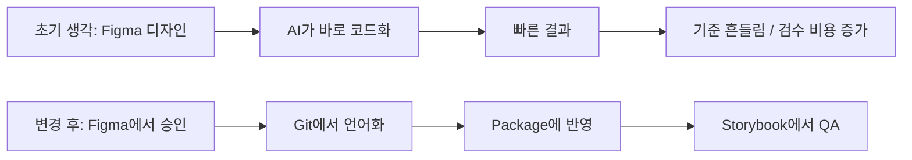

# 1편. AI로 디자인을 바로 코드화하려다 멈춘 이유

## 한 줄 요약

처음에는 Figma 디자인을 AI에게 바로 코드로 바꾸게 하면 빠를 거라고 생각했다. 하지만 실제로 해보니 토큰 소모도 컸고, 디자이너의 탐색 과정이 오히려 좁아지는 문제가 있었다. 그래서 방향을 바꿨다. AI가 바로 완성본을 만드는 흐름이 아니라, Figma에서 승인된 기준만 Git과 Storybook으로 이어지는 workflow를 만들기로 했다.

---

## 처음 생각한 방식

AX 실험 초반에는 아주 단순하게 생각했다.

```text
Figma에서 디자인한다
-> AI에게 코드로 바꾸게 한다
-> 화면을 확인한다
-> 어긋난 부분을 다시 고친다
```

처음 보기에는 이 방식이 가장 빠를 것 같았다. 디자이너가 화면을 만들고, AI가 코드를 만들고, 필요한 부분만 수정하면 되는 구조처럼 보였다.

그런데 실제로 해보니 문제가 있었다.

---

## 문제 1. 토큰을 너무 많이 썼다

디자인을 바로 코드로 바꾸려면 AI에게 설명해야 할 것이 너무 많았다.

- 이 컴포넌트가 어떤 역할인지
- 어떤 토큰을 써야 하는지
- 어떤 상태값이 있는지
- light/dark mode에서 어떻게 바뀌어야 하는지
- 긴 텍스트나 일본어가 들어오면 어떻게 처리해야 하는지
- 이것이 승인된 Figma 컴포넌트인지, 아직 탐색 중인 시안인지

결국 Figma 화면 하나를 코드로 바꾸는 일이 아니라, 디자인 시스템 전체 맥락을 매번 다시 설명하는 일이 됐다.

AI가 똑똑해도, 기준이 입력되지 않으면 그럴듯한 값을 새로 만든다. 이 과정에서 토큰 소모도 커지고, 결과를 검수하는 비용도 같이 커졌다.

---

## 문제 2. AI가 너무 빨리 완성본을 만들었다

더 큰 문제는 토큰보다 탐색 방식이었다.

디자인 탐색 과정에는 일부러 덜 정리된 상태가 필요하다. 여러 방향으로 발산하고, 이상한 안도 만들어보고, 기준을 깨보는 시간이 있어야 한다.

그런데 AI는 아주 빨리 그럴듯한 완성본을 만든다. 완성도가 있어 보이는 결과물이 나오면, 그 순간부터 사고가 좁아진다.

처음에는 이런 흐름이었다.

```text
디자이너가 탐색 중인 아이디어를 전달
-> AI가 완성된 화면/코드처럼 만들어줌
-> 결과물이 정답 후보처럼 보임
-> 이후 탐색이 "다른 방향"이 아니라 "이 결과물 수정"으로 좁아짐
```

이건 효율처럼 보이지만, 디자인 발산 단계에서는 오히려 위험했다. 특히 브랜드 방향이나 제품 톤을 찾는 단계에서는 더 그랬다.

AI가 빠르게 완성해주는 능력이, 디자이너가 생각의 틀을 깨는 과정을 방해할 수 있었다.

한 번에 완성된 화면이 생기면, 아직 덜 익은 생각을 더 이상 과감하게 흔들어보기 어려워졌다. 시도해보고 버려야 할 단계인데도, 결과물이 너무 정리되어 있으니 "이걸 어떻게 더 좋게 고칠까" 쪽으로 사고가 묶이는 느낌이 있었다.

---

## 문제 3. 코드가 너무 빨리 기준처럼 굳어졌다

AI가 만든 코드가 실제 구현처럼 보이기 시작하면 또 다른 문제가 생긴다.

아직 Figma에서 승인되지 않은 시안인데도, 코드가 생긴 순간부터 그 코드가 기준처럼 취급될 수 있다.

```text
탐색 시안
-> AI 코드
-> Storybook 또는 preview
-> "이미 구현된 것"처럼 보임
-> 나중에 Figma 기준과 충돌
```

디자인 시스템에서는 이게 특히 위험했다. Figma에 없는 컴포넌트가 package나 Storybook에 먼저 생기면, 나중에 무엇이 source of truth인지 헷갈린다.

그래서 직접 코드화 방식은 빠르지만 안전하지 않았다.

---

## 전환점. FE 패키지를 받으면서 방향이 바뀌었다

이후 FE가 실제 package를 제공하면서 생각이 바뀌었다.

이제 목표는 AI가 디자인을 바로 코드로 만드는 것이 아니었다.

목표는 Figma에서 승인된 기준만 package와 Storybook으로 이어지게 만드는 것이었다.



이 구조에서는 각 도구의 역할이 분명해졌다.

| 단계 | 역할 |
| --- | --- |
| Figma | 디자이너가 시각 기준을 탐색하고 승인하는 곳 |
| Git | 승인된 Figma 기준을 FE와 AI가 이해할 수 있는 언어로 바꾸는 곳 |
| Package | FE가 실제 제품에서 쓸 수 있는 구현 경계 |
| Storybook | package에 반영된 결과를 디자이너와 FE가 함께 검수하는 곳 |

Git은 단순히 코드를 저장하는 곳이 아니었다. Figma의 시각 판단을 component contract, token contract, agent rules, workflow 문서로 언어화하는 중간 레이어였다.

---

## 이번 실험에서 바뀐 관점

처음에는 이렇게 생각했다.

```text
AI를 잘 쓰면 디자인을 빠르게 코드로 만들 수 있다.
```

실험 후에는 이렇게 바뀌었다.

```text
AI를 잘 쓰려면, 무엇을 코드로 만들기 전에
무엇이 승인된 기준인지 먼저 설계해야 한다.
```

AI는 완성본을 만드는 데만 쓰기보다, 탐색 재료를 넓히고, 기준을 비교하고, 누락을 찾고, 다음 작업을 정리하는 데 더 안정적으로 쓸 수 있었다.

완성은 디자이너가 방향을 승인한 뒤에 진행하는 것이 맞았다.

---

## 이 편의 결론

AI로 디자인을 바로 코드화하는 방식은 빠르게 보인다. 하지만 디자인 시스템 작업에서는 오히려 기준을 흔들 수 있다.

특히 탐색 단계에서는 AI가 너무 빨리 완성본을 만들면 디자이너의 사고가 좁아질 수 있다. 그래서 이번 실험에서는 직접 코드화보다, Figma에서 승인된 기준만 Git과 Storybook으로 이어지게 하는 구조가 더 적합하다고 판단했다.

다음 편에서는 이 구조를 실제로 어떻게 나눴는지, `Figma -> Git -> Package -> Storybook -> Worklog/Wiki` 운영 루프를 정리한다.
