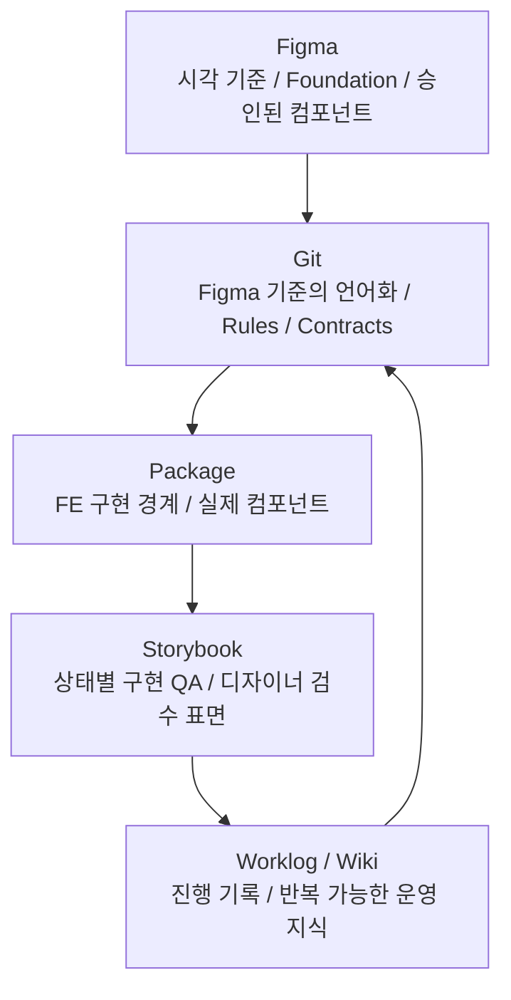

# 2편. Figma를 Git으로 번역하고 Storybook으로 검수하기

## 한 줄 요약

이번 AX 실험의 핵심 workflow는 `Figma 승인 -> Git 언어화 -> Package 반영 -> Storybook QA -> Worklog/Wiki 기록`이었다. AI는 이 흐름 안에서 기준을 비교하고, 누락을 찾고, 문서를 정리하고, 다음 작업을 계산하는 역할을 했다.

---

## 왜 이런 루프가 필요했나

AI를 디자인 시스템에 붙이면 결과물은 빠르게 나온다. 하지만 빠른 결과보다 중요한 것은 기준이 흔들리지 않는 것이다.

실험 중 가장 자주 부딪힌 질문은 이것이었다.

```text
이 기준은 어디에서 온 것인가?
Figma인가?
Git 문서인가?
FE package인가?
Storybook인가?
AI가 추측한 값인가?
```

이 질문에 답하지 못하면, AI가 만든 결과가 그럴듯해도 실제 제품 기준으로는 위험했다.

그래서 각 도구의 역할을 분리했다.

---

## 5개 채널 역할 맵



이 구조에서 중요한 점은 Storybook이 Figma를 대체하지 않는다는 것이다. Storybook은 구현 검수 표면이다. 시각 원본은 Figma이고, Git은 Figma의 결정을 FE와 AI가 이해할 수 있는 언어로 바꾸는 곳이다.

---

## Figma의 역할: 시각 기준을 승인하는 곳

Figma는 단순히 화면을 그리는 곳이 아니었다. AI가 임의로 흔들 수 없는 시각 기준을 고정하는 곳이었다.

이번 실험에서 Figma 안에서는 특히 Foundation 설계가 중요했다.

- color
- typography
- spacing
- radius
- shadow/elevation
- semantic alpha
- state token
- icon size
- light/dark mode
- 다국어와 긴 텍스트 대응

예를 들어 disabled 상태를 opacity로 처리할지, semantic token으로 처리할지 기준이 없으면 컴포넌트마다 다른 방식이 생긴다. 다크모드도 단순 반전처럼 처리될 수 있다.

그래서 Figma Foundation은 디자이너의 시각 기준이면서, AI가 디자인 시스템 안에서만 움직이게 하는 첫 번째 안전장치였다.

---

## Figma-first는 Figma-only가 아니었다

이번 실험에서 중요한 구분도 생겼다.

Figma가 시각 기준의 source of truth라는 말이, 모든 탐색을 Figma에서만 해야 한다는 뜻은 아니었다.

인터랙션, 데이터 상태, 입력, 로딩, 에러, 모바일 반응형처럼 실제 동작을 봐야 판단되는 화면은 코드 prototype, Storybook screen, local app 같은 실행 가능한 표면에서 먼저 보는 편이 더 빠를 수 있었다.

다만 승인 기준은 다시 Figma와 contract로 돌아와야 했다.

```text
탐색은 여러 표면에서 할 수 있다.
하지만 승인된 기준은 Figma와 Git contract에 남긴다.
```

이 구분이 없으면 "코드로 빨리 봤던 시안"이 어느 순간 승인된 디자인처럼 취급된다. 반대로 이 구분이 있으면 AI와 코드 prototype을 탐색 도구로 쓰면서도, 최종 디자인 시스템 기준은 Figma와 Git에 안정적으로 남길 수 있다.

---

## Git의 역할: Figma를 언어화하는 곳

Git은 Figma를 대체하는 곳이 아니었다. Git은 Figma에서 승인된 결정을 언어화하는 곳이었다.

Figma의 시각 판단은 그대로는 FE나 AI가 일관되게 실행하기 어렵다. 그래서 Git 안에서 아래 형태로 번역했다.

| Figma에서의 기준 | Git에서의 언어화 |
| --- | --- |
| component set | component contract |
| variant axis | prop / state 기준 |
| color variable | token contract |
| Foundation rule | agent rule |
| 시각 판단 이유 | decision / sync log |
| 반복되는 시행착오 | wiki / playbook |

이번 실험에서 `docs/agent-rules.md`, `docs/workflows.md`, component contract, token contract가 중요했던 이유가 여기에 있다.

Git 문서는 코드 저장소라기보다, AI와 FE가 같은 기준으로 움직이게 하는 운영 언어였다.

---

## Package의 역할: FE 구현 경계

FE가 제공한 Prism package는 workflow의 중요한 기준점이었다.

이전에는 AI가 코드를 직접 만들면 됐지만, 실제 package가 생긴 뒤에는 아무 코드나 만들면 안 됐다. public API, DOM semantics, ARIA, keyboard behavior, CSS import path, token compatibility를 지켜야 했다.

그래서 package source는 AI가 마음대로 수정하는 대상이 아니었다.

차이가 보이면 먼저 분류해야 했다.

```text
Figma 문제인가?
Git contract 문제인가?
Package source 문제인가?
Storybook QA surface 문제인가?
```

package 변경이 정말 필요하다면, 그때는 명시적인 승인과 함께 진행해야 했다.

---

## Storybook의 역할: 디자이너와 FE가 함께 보는 QA 표면

Storybook은 FE 도구처럼 보이지만, 이번 실험에서는 디자이너 QA 표면으로도 중요했다.

화면마다 같은 버튼, 입력창, 모델 프로필, 상태값을 반복 확인하는 대신, Storybook에서 한 번에 비교할 수 있었다.

- variant
- size
- disabled
- loading
- long label
- light/dark mode
- interaction
- locale

예를 들어 Button matrix story는 컴포넌트의 여러 상태를 한 화면에서 비교할 수 있게 했다. Chromatic baseline을 만들면 변경 여부도 감이 아니라 diff로 볼 수 있었다.

단, Storybook page shell은 Figma와 같을 필요가 없다. 중요한 것은 Storybook에 렌더링된 component internals가 Figma token과 contract를 따르는지였다.

---

## Worklog와 Wiki의 역할

작업이 끝났다고 workflow가 끝나는 것은 아니었다. 판단 이유와 실패 경로를 남겨야 다음 세션에서 같은 일을 반복하지 않았다.

이번 실험에서는 worklog와 wiki를 분리했다.

| 채널 | 역할 |
| --- | --- |
| Worklog | 날짜별 원본 기록. 계획, 작업 체크, 실패, 미완료, 다음 액션 |
| Wiki | 반복 가능한 교훈. guide, playbook, 운영 규칙 |

worklog는 단순 회고가 아니었다.

```text
계획을 적는다
-> 작업하면서 체크한다
-> 미완료와 새 리스크를 분리한다
-> 다음 할 일을 계산한다
-> 반복되는 교훈은 wiki로 승격한다
```

이 구조 덕분에 AI 세션이 끊겨도 다음 세션에서 이어갈 수 있었다.

---

## Wiki는 별도의 리서치 산출물이었다

Wiki는 단순히 worklog를 예쁘게 정리한 문서가 아니었다. 오히려 wiki를 만들기 위해 별도의 리서치가 많이 필요했다.

이번 실험에서 조사한 것은 단순히 "Figma랑 Storybook을 연결하는 법"이 아니었다.

- Figma, Git, Storybook이 각각 어떤 역할을 가져야 하는지
- Storybook을 디자이너 QA 표면으로 쓸 수 있는지
- FE package와 Figma component 기준을 어떻게 맞출지
- AI 에디터가 읽을 수 있는 진입 문서를 어떻게 만들지
- Claude Code, Codex 같은 도구별 작업 방식 차이를 어떻게 나눌지
- worklog의 날것 기록을 언제 wiki guide/playbook으로 승격할지
- 디자이너가 FE와 대화할 때 필요한 용어와 계약 언어는 무엇인지

그래서 wiki는 단순 보관소가 아니라, 실험 중 나온 질문을 조사하고 팀이 다시 쓸 수 있는 형태로 정제한 지식 베이스였다.

```text
worklog = 오늘 무슨 일이 있었는지
wiki = 그 일을 겪고 나서 다음에도 쓸 수 있는 운영 지식은 무엇인지
```

예를 들어 `Figma / Git Sync 경계`, `Component Update Playbook`, `Agent Handoff Playbook`, `Daily Worklog to Wiki` 같은 문서는 모두 그냥 기록이 아니라, 실제 작업 중 생긴 혼란을 다시 반복하지 않기 위해 리서치하고 정리한 결과물이었다.

이 점에서 wiki는 workflow의 마지막 기록 단계가 아니라, 다음 실험의 기준을 만드는 리서치 레이어였다.

---

## 실제 사례: Button 루프

Button 작업에서 이 루프가 실제로 검증됐다.

```text
Figma Button evidence 확인
-> package contract 확인
-> Storybook Button stories 확인
-> light/dark QA
-> 차이 발견
-> Figma / package / Storybook 중 어느 문제인지 분류
-> package source 임의 수정은 revert
-> rule과 worklog에 기록
```

처음에는 Storybook에서 Button이 Figma와 달라 보여 package token과 implementation을 수정했다. 하지만 이후 "개발자가 추가한 package code를 디자인 동기화 목적으로 임의 수정하면 안 된다"는 조건과 충돌한다는 점을 확인했고, 변경을 revert했다.

이 경험 이후 룰이 생겼다.

- 차이가 보이면 바로 고치지 않는다.
- 먼저 source가 어디인지 분류한다.
- package source 변경은 승인 후 진행한다.
- Storybook은 QA surface이지 source of truth가 아니다.

---

## 이 루프에서 AI가 잘한 일

AI는 이 workflow 안에서 특히 아래 일을 잘했다.

- 여러 문서를 한 번에 비교하기
- Figma evidence와 package contract 차이 찾기
- Storybook 설정 오류 수정하기
- 누락된 export, demo 사용처 찾기
- worklog 누락과 공개 viewer 불일치 찾기
- 다음 세션의 checklist와 handoff 만들기

반대로 AI가 혼자 결정하면 안 되는 것도 분명했다.

- 브랜드 톤
- 최종 시각 품질
- package source 변경 승인
- Chromatic diff 승인
- Figma 탐색물과 승인 컴포넌트의 구분

---

## 이 편의 결론

이번 실험에서 Git은 Figma를 대체하지 않았다. Git은 Figma를 언어화했다.

Storybook도 Figma를 대체하지 않았다. Storybook은 package에 반영된 결과를 검수했다.

AI도 디자이너를 대체하지 않았다. AI는 기준을 비교하고, 누락을 찾고, 기록을 다음 작업으로 바꾸는 운영 파트너에 가까웠다.

다음 편(3편)에서는 이 루프를 안전하게 굴리기 위해 필요했던 장치들을 정리한다. 먼저 **기준 설계** — Figma Foundation과 Git Rules — 부터 다룬다. 이어 4편에서는 Worklog·문서 레벨·모바일/데스크톱 분업 같은 **운영 설계**를, 5편에서는 **마지막 디테일은 디자이너의 몫**이라는 결론을 정리한다.
