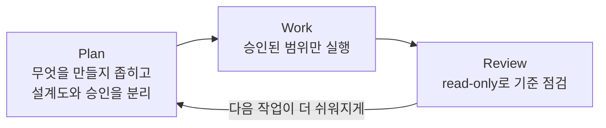

# AI 협업에서 Plan, Work, Review를 잡는 법

AI와 일할 때 가장 위험한 순간은 작업이 느릴 때가 아니다. 오히려 너무 빨리 그럴듯한 결과가 나올 때다.

문제가 충분히 정의되지 않았는데 화면이 생기고, 승인되지 않은 방향이 적용되고, 탐색 중이던 아이디어가 완성본처럼 굳어질 수 있다. 그래서 AI 협업에서는 "무엇을 만들까"만큼 "언제 멈추고 무엇을 확인할까"가 중요하다.

이 편에서는 디자이너 관점에서 plan, work, review를 어떻게 나누면 좋은지 정리한다.



## 1. Ideate: 만들기 전에 줄일 수 있는지 본다

아이디어 단계는 많이 만드는 단계가 아니라, 만들 가치가 있는 문제를 좁히는 단계다.

디자이너가 먼저 볼 질문은 이런 것이다.

- 사용자는 어디에서 가장 많이 막히는가?
- 새 화면을 만들기 전에 없애거나 단순화할 수 있는 것은 없는가?
- 이 문제는 디자인으로 풀 문제인가, 제품 정책이나 정보 구조로 풀 문제인가?
- 지금 만들면 다음 작업이 더 쉬워지는가?

AI는 후보를 넓히는 데 좋다. 하지만 무엇을 남길지는 사람이 판단해야 한다.

## 2. Brainstorm: 아이디어를 요구사항으로 바꾼다

"설정 화면 개선"은 아직 요구사항이 아니다. AI가 바로 작업하기에는 너무 넓다.

작업 전에 아래를 정리하면 결과가 훨씬 안정된다.

- 이 화면의 사용자는 누구인가?
- 사용자가 해결하려는 문제는 무엇인가?
- 제품, 브랜드, 기술, 접근성, 다국어 제약은 무엇인가?
- empty, loading, error, long text 같은 edge case가 있는가?
- 완료 기준은 무엇인가?

좋은 완료 기준은 "더 예뻐졌다"가 아니라 "사용자가 어떤 결정을 더 쉽게 할 수 있다"처럼 확인 가능한 문장이어야 한다.

## 3. Plan: 설계도와 실행 승인을 분리한다

AI 협업에서 plan은 매우 중요하다. 하지만 plan이 곧 실행 승인은 아니다.

Plan은 이런 역할을 한다.

- 문제와 목표를 정리한다.
- 영향을 받는 화면과 컴포넌트를 확인한다.
- 재사용할 기존 요소를 찾는다.
- 새로 필요한 상태를 분리한다.
- 다국어, 다크모드, 접근성, 반응형 리스크를 적는다.
- QA 기준을 정한다.

여기까지는 아직 설계도다. 실제 Figma 파일을 수정하거나 package 코드를 바꾸는 일은 별도 승인 뒤에 진행하는 편이 안전하다.

특히 AI에게는 이렇게 요청하는 것이 좋다.

```text
이 화면을 바로 만들지 말고 먼저 read-only로 분석해줘.
사용자 문제, 대상 화면, 재사용 가능한 컴포넌트, 새로 필요한 상태,
다국어/다크모드/접근성 리스크, 검증 기준을 정리해줘.
아직 파일은 수정하지 마.
```

이 한 문장만 있어도 AI가 바로 손대는 일을 줄일 수 있다.

## 4. Work: 승인된 범위 안에서만 만든다

실행 단계에서는 속도가 장점이다. AI는 빠르게 정리하고, 반복 작업을 줄이고, 후보를 많이 만들 수 있다.

그래서 work 단계에서 더 중요한 것은 범위다.

- 승인된 화면만 수정했는가?
- 기존 컴포넌트와 토큰을 재사용했는가?
- 새 스타일을 임의로 만들지 않았는가?
- 변경된 화면, 컴포넌트, 상태가 기록되었는가?
- 되돌릴 수 있는 범위가 명확한가?

AI가 뭔가를 더 낫게 만들 수 있다고 판단해도, 디자인 시스템에서는 그 실행력이 위험할 수 있다. 좋은 의도라도 source of truth를 흔들면 다음 작업 비용이 커진다.

## 5. Review: 결과를 고치는 데서 끝내지 않는다

리뷰는 결과물을 고치는 단계이기도 하지만, 다음번에 같은 문제가 반복되지 않도록 학습을 남기는 단계이기도 하다.

화면 리뷰에서 볼 것:

- 정보 구조가 명확한가?
- CTA가 잘 보이는가?
- 긴 텍스트와 다국어에서 깨지지 않는가?
- empty, loading, error 상태가 있는가?
- 다크모드에서도 의도가 유지되는가?
- 모바일에서 터치 영역과 safe area가 적절한가?

컴포넌트 리뷰에서 볼 것:

- token이 맞는가?
- variant가 누락되지 않았는가?
- Storybook에서 상태별로 확인 가능한가?
- 접근성 이름과 키보드 동작이 유지되는가?

여기서 중요한 것은 리뷰 코멘트를 규칙으로 바꾸는 것이다.

```text
"여기 다크모드가 이상해요"
-> raw color를 쓰지 말고 semantic token을 사용한다.

"AI가 없는 variant를 만들었어요"
-> Figma에 없는 variant는 package에 먼저 만들지 않는다.

"계획만 봤는데 파일이 바뀌었어요"
-> plan/worklog/backlog는 실행 승인으로 보지 않는다.
```

## 6. Compound: 배운 것을 다음 작업의 기본값으로 만든다

작업이 끝난 뒤 가장 중요한 질문은 이것이다.

```text
다음번에는 이 문제를 시스템이 먼저 잡을 수 있을까?
```

잡을 수 없다면 뭔가를 남겨야 한다.

- 규칙으로 남길지
- 체크리스트로 남길지
- 컴포넌트 계약으로 남길지
- Storybook QA로 남길지
- worklog나 wiki에만 남기면 되는지

모든 것을 큰 문서로 만들 필요는 없다. 중요한 것은 다음 작업자가 같은 판단을 다시 설명받지 않아도 되는 상태를 만드는 것이다.

## 디자이너가 오늘 바로 할 수 있는 것

AI에게 작업을 맡기기 전에 아래 템플릿을 붙여본다.

```text
변경안만 먼저 제안해줘.
영향받는 화면/컴포넌트, 바뀌는 스타일 또는 토큰,
되돌릴 수 있는 범위, QA 방법을 포함해줘.
승인 전까지 실제 파일 수정은 하지 마.
```

이 요청은 AI를 느리게 만드는 것이 아니다. 작업이 잘못된 방향으로 빨라지는 것을 막는다.

## 마무리

AI 협업에서 좋은 plan은 작업을 통제하기 위한 문서가 아니다. 좋은 결과가 반복되도록 의도와 제약을 남기는 장치다.

다음 편에서는 디자이너의 취향과 판단을 어떻게 시스템에 넣을 수 있는지 다룬다. 매번 "이건 좀 이상해요"라고 말하는 대신, 다음번에는 AI가 먼저 피할 수 있게 만드는 방법이다.
